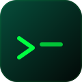

<p align="center">
  
</p>

<h1 align="center">
  ne<em>sh</em>
</h1>

<h3 align="center">
  Your terminal, <strong>supercharged</strong> with AI.
</h3>

<p align="center">
  Type commands as usual. Prefix with <code>a</code> to invoke Claude<br/>
  with full filesystem and terminal access.
</p>

<p align="center">
  <a href="https://www.npmjs.com/package/nesh"></a>
  <a href="https://github.com/tantantech/nesh/actions"></a>
  <a href="https://nesh.sh"></a>
  <a href="https://github.com/tantantech/nesh/blob/main/LICENSE"></a>
</p>

<br />

<p align="center">
  
</p>

<br />

## Everything you need, nothing you don't

A shell that stays out of your way for normal commands and brings full AI power when you need it.

```
$ git status                              # normal command — works as expected
$ docker ps                               # pipes, redirects, globs — all work
$ a find all TODO comments and summarize   # prefix with "a" for AI
  → Reading src/...
  → Running grep -rn "TODO" src/...

Found 7 TODOs across 4 files:
  src/auth.ts:42    TODO: add rate limiting
  src/db.ts:18      TODO: connection pooling
  ...
```

One keystroke. Zero context-switching.

---

### Shell First

Every command works as expected — pipes, redirects, globs. Nesh delegates to your system shell.

### Instant AI

Prefix with `a` and Claude reads files, runs commands, writes code — all streamed in real-time.

### Chat Mode

Type `a` alone to enter persistent chat. Multi-turn conversations with full tool access. `/exit` to return.

### Model Selection

Choose your model per query: `--opus` for deep reasoning, `--haiku` for quick answers, `--sonnet` by default.

### Error Auto-Fix

Failed commands are analyzed instantly. Nesh suggests a fix and `a fix` applies it. Zero copy-paste.

### Pipe Mode

Works as a Unix pipe citizen. Pipe files into Nesh or pipe AI output to other commands.

### Cost Tracking

See token usage and cost after every AI response. Per-message and per-session cost breakdowns.

### Agent SDK

Built on the official [Claude Agent SDK](https://www.npmjs.com/package/@anthropic-ai/claude-agent-sdk). Full tool-use: file read/write, command execution, code editing.

---

## Four steps. Zero friction.

**01 — You type a command**
Regular shell commands work exactly as expected. No learning curve.

```
$ git status
```

**02 — Nesh classifies it**
Builtin? Shell command? AI request? Routing is instant.

```
classify(input) → builtin | passthrough | ai
```

**03 — Prefix "a" for AI**
Claude reads files, runs commands, and writes code — streamed live.

```
$ a refactor src/utils.ts to use async/await
```

**04 — See everything**
Tool calls are shown in real-time. Full transparency, full control.

```
→ Reading src/utils.ts...
→ Writing src/utils.ts...
→ Running npm test...

Done. Refactored 3 functions, all 24 tests passing.
```

---

## 30+ Models, 15 Providers

Switch between any model with a single command. No config files, no API wrapper headaches.

```
$ a --opus explain the architecture        # Claude Opus 4.6
$ a --haiku summarize this file            # Claude Haiku 4.5
$ a --gpt-4o review my code               # GPT-4o
$ a --gemini-pro analyze this dataset      # Gemini 2.5 Pro
$ a --grok-4 what does this regex do       # Grok 4
$ model                                    # Interactive model picker
```

<details>
<summary><strong>Full provider list</strong></summary>

| Tier | Provider | Models |
|------|----------|--------|
| **Big Tech** | Anthropic | Claude Opus 4.6, Sonnet 4.5, Haiku 4.5 |
| | OpenAI | GPT-4o, GPT-4.5, o3, o4-mini |
| | Google | Gemini 2.5 Pro, Gemini 2.5 Flash |
| **Major AI** | xAI | Grok 4, Grok 3 |
| | DeepSeek | Chat, Reasoner |
| | Mistral | Large, Codestral, Small |
| | Cohere | Command R+, Command R |
| | MiniMax | M2.5, M2.7 |
| **Fast Inference** | Groq | Llama 3.3 70B, Mixtral 8x7B, Gemma 2 |
| | Together AI | Llama 3.3 70B, Qwen 2.5 Coder |
| | Fireworks | Llama 3.3 70B |
| **Aggregators** | OpenRouter | Any model on OpenRouter |
| | Ollama | Any local model |
| | Perplexity | Sonar Pro, Sonar |

</details>

---

## 5 Prompt Themes

```
$ theme
```

| Theme | Style |
|-------|-------|
| **Minimal** | `nesh ~/Projects > ` |
| **Classic** | `[nesh] ─ ~/Projects (main) ─▸ ` |
| **Powerline** | ` nesh  ~/Projects  main  ❯ ` |
| **Hacker** | `┌─[nesh]─[~/Projects]─[main]` |
| **Pastel** | `● nesh │ ~/Projects │ main ❯ ` |

---

## Install

```bash
npm install -g nesh
```

> **Requirements:** Node.js 22+ and at least one AI provider API key.

## Quick Start

```bash
# 1. Install
npm install -g nesh

# 2. Set an API key (any provider works)
export ANTHROPIC_API_KEY=sk-ant-...    # or
export OPENAI_API_KEY=sk-...           # or
export GOOGLE_API_KEY=...              # or any of 15 providers

# 3. Launch
nesh

# 4. Use it
$ ls                          # normal command
$ a what does main.ts do      # AI command
```

## Configuration

Config file at `~/.nesh/config.json`:

```json
{
  "api_key": "sk-ant-...",
  "model": "claude-sonnet",
  "history_size": 1000,
  "prefix": "a",
  "permissions": "auto"
}
```

| Field | Default | Description |
|-------|---------|-------------|
| `model` | `claude-sonnet` | Default model (any shorthand from the model list) |
| `history_size` | `1000` | Max command history entries |
| `prefix` | `a` | AI trigger prefix (customizable) |
| `permissions` | `auto` | Tool permissions: `auto`, `ask`, or `deny` |

### Per-Project Config

Drop a `.nesh.json` in any project root to override settings:

```json
{
  "model": "gpt-4o",
  "permissions": "ask"
}
```

### API Key Management

```
$ keys                 # See configured providers
$ keys add openai      # Add a provider key
$ keys remove openai   # Remove a provider key
```

---

## Clean, auditable, minimal

18 modules. ~1,750 lines of TypeScript. Every module has a single responsibility.

```
cli.ts ──▸ shell.ts ──▸ classify.ts ─┬─▸ builtins.ts
                                     │
                                     ├─▸ passthrough.ts
                                     │
                                     └─▸ ai.ts
                                          │
                                          └─▸ renderer.ts
```

`Node.js 22+` · `TypeScript 6` · `Claude Agent SDK` · `ESM` · `Vitest` · `tsdown`

---

## Development

```bash
git clone https://github.com/tantantech/nesh.git
cd nesh
npm install
npm run dev        # Run with tsx (no build step)
npm test           # Run tests
npm run build      # Bundle to dist/cli.js
```

## Contributing

PRs welcome. Please include tests for new features.

```bash
git clone https://github.com/tantantech/nesh.git
cd nesh
npm install
npm test          # Make sure tests pass
```

## License

[MIT](LICENSE)

---

<p align="center">
  <strong><a href="https://nesh.sh">nesh.sh</a></strong> · Built by <a href="https://github.com/tantantech">tantantech</a>
</p>
